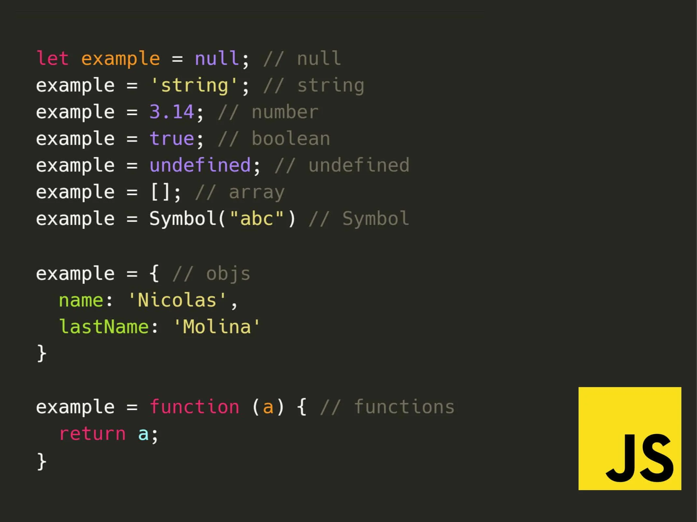

# ts-fundamentals

## Install TypeScript

```bash
npm install typescript --save-dev
```

## Compile TypeScript

Para realizar el proceso de transpilación en Node.js, ejecutemos lo siguiente en la terminal:

```bash
npx tsc <route-file>.ts
```

Tras esto, se creará un archivo JavaScript dentro de la misma carpeta donde este tu archivo TypeScript y con el mismo nombre. Por ejemplo, en nuestro proyecto realizamos esa operación dentro de la carpeta src con el archivo 01-hello.ts.

### Compile a specific JavaScript version

Podemos hacer que nuestro archivo TypesSript sea transpilado a un archivo JavaScript, por ejemplo, con el estándar ECMAScript 6. Para ello ejecutemos:

```bash
npx tsc <route-file>.ts --target es6
```

### Send the output to a specific folder

Si deseas que los archivos transpilados no se generen en la misma carpeta donde están tus archivos TypeScript, puedes indicarle al compilador hacia donde quieres que vayan:

```bash
npx tsc archivo_typescript.ts --target es6 --outDir carpeta_destino
```

Generalmente estos archivos se guardan en la carpeta dist.

También podrías indicar que deseas aplicar la anterior operación a todos los archivos con extensión TypeScript:

```bash
npx tsc *.ts --target es6 --outDir carpeta_destino
```

### Deno: un entorno nativo para ambos lenguajes

Deno, del mismo creador de Node.js, es un nuevo entorno de ejecución para JavaScript que puede correr también nativamente TypeScript. Sin embargo, aún no tiene la madurez en el ecosistema de Node.js

### Resume image


## Creando un archivo TSConfig.json

En la terminal, ubicándonos dentro del directorio en el que queremos que se cree el archivo, ejecutemos:

```bash
npx tsc --init
```

Nos creará automáticamente el archivo con propiedades básicas activadas:


Dentro del archivo `TSConfig.json` podemos ver que tiene muchas propiedades comentadas (desactivadas) y de las cuales solo algunas están activadas.

Luego, se le quita el comentario a la propiedad `outDir` y se le asigna el valor de `./dist` para que los archivos transpilados se guarden en la carpeta dist. Además, nos ahorra tener que enviar `--outDir dist` cada vez que queramos [transpilar](#send-the-output-to-a-specific-folder) un archivo TypeScript.

```json
{
  "outDir": "./dist",
}
```

Otra propiedad que se puede activar es `rootDir`, la cual indica la carpeta donde se encuentran los archivos TypeScript. Si no se especifica, TypeScript asume que los archivos están en la raíz del proyecto.

```json
{
  "outDir": "./dist",
  "rootDir": "./src"
}
```

Y ya se puede transpilar los archivos TypeScript sin necesidad de enviar la ruta del archivo y la carpeta de destino:

```bash
npx tsc
```

## Compilación en tiempo real

Nos puede resultar tedioso estar ejecutando el comando anterior siempre después de escribir nuestro código. Para evitar esto, podemos hacer que el compilador esté detectando cada cambio que realicemos en nuestros archivos TypeScript y haga la transpilación de inmediato:

```bash
npx tsc --watch
```

## Tipado o type annotation en TypeScript

El tipado en TypeScript hace referencia a cómo declaramos una variable, necesitamos asignar el tipo de dato, conocido como **type annotation**, con esto evitamos mezclar distintos tipos de datos.

### La flexibilidad de JavaScript

Nosotros podemos declarar una variable de un tipo de valor y a lo largo del código ir cambiándolo si lo deseamos. Por lo que en un momento puede ser de tipo `string` y después de tipo `boolean`:


Para proyectos de sofware que tienen una gran escalabilidad, esto podría ser fuente de fallas en el programa.

### Controlando la flexibilidad

Gracias a TypeScript podemos manejar el tipado de las variables para evitar anomalías en el código.

En **JavaScript**, para declarar una variable constante lo realizamos así:

```javascript
const productPrice = 12;
```

En **TypeScript**, para el caso anterior, es similar solo que añadimos `:` y el tipo de dato de la variable, la cual sería `number`. A esto último se le llama **type annotation** o anotación de tipo:

```typescript
const productPrice: number = 12;
```

## Number

El tipo de dato `number` se usa para variables que contendrán números positivos, negativos o decimales.

### Operaciones

En JavaScript, una variable de tipo `number` puede fácilmente ser concatenado con otra de tipo `string`:

```js
// JAVASCRIPT
let myNumber = 30; 
myNumber = myNumber + "5"; //El resultado sería '305'
```

Sin embargo, esto podría llevar confusiones y errores durante la ejecución del programa, además de estar cambiando el tipo de dato de la variable. Por ello, en TypeScript solo se pueden hacer operaciones numéricas entre números valga la redundancia:

```ts
//TypeScript
let myNumber: number = 30; 
myNumber = myNumber + 10; //CORRECTO 
myNumber = myNumber + "10"; //INCORRECTO
```

### Uso de variables sin inicializar

- Serán señalados como errores aquellas variables que queramos usar sin haberles dado un valor inicial:

```ts
//TypeScript 
let productInStock: number; 
console.log("Product in stock: " + productInStock);
```

Señalar que si no se va a inicializar aún la variable, definir explícitamente el tipo de dato, pues TypeScript no puede inferirlo si no tiene un valor inicial.

### Conversión de números de tipo string a tipo number

Para esto usaremos el método `parseInt`:

```ts
let discount: number = parseInt("123"); 
let numeroString: string = "100"; 
let nuevoNumero: number; 
nuevoNumero = parseInt(numeroString);
```

Esto funciona si el string tiene solo y exclusivamente números que no empiecen con 0. De lo contrario, el resultado será de tipo `NaN` (Not a Number):

```ts
//TypeScript 
let numeroPrueba: number = parseInt("palabra"); 
console.log(numeroPrueba); //NaN
```

### Binarios y Hexadecimales

TypeScript nos puede indicar error si intentamos definir números binarios que tengan números que no sean 0 o 1 y si declaramos hexadecimales usando valores fuera del rango:

```ts
//**********TypeScript********** 
//Binarios: se definen colocando "0b" al inicio del valor 
let primerBinario = 0b1010; //CORRECTO 
let segundobinario = 0b1210; //INCORRECTO. El 2 es inválido 

//Hexadecimales: se definen colocando "0x" al inicio del valor 
let primerHexa = 0xfff; //CORRECTO 
let segundoHexa = 0xffz; //INCORRECTO. El "z" es inválido
```

En consola, si están correctamente asignados, se hará una conversión a decimal de dichos números:

```ts
let primerHexa = 0xfff; 
console.log(primerHexa); // 4095 
let primerBinario = 0b1010; 
console.log(primerBinario); // 10
```

### Consejo

Cuando definas una variable de tipo de dato `number`, es preferible que el nombre de tipo sea en minúscula. Esto como buena práctica, pues se hará referencia al tipo de dato `number` y **no al objeto** `Number` propio del lenguaje:

```ts
let myNumber: number = 20; // Buena practica. 
let otherNumber: Number = 20; // Mala practica.
```

## String

Este tipo de dato nos permite almacenar una cadena de caracteres.

Podemos definir un `string` con:

1. Comillas simples:

```ts
let myProduct = 'Soda'; //CORRECTO 
let comillasDobles = 'Puedo "usar" comillas dobles tambien'; //CORRECTO 
let comillaInvalida = 'No puedo 'usar' otra vez una comilla simple'; //INCORRECTO
```

Se pueden usar comillas dobles dentro, más no otra vez comillas simples.

2. Comillas dobles:

```ts
let myProduct = "Soda"; //CORRECTO 
let comillaSimple = "Puedo 'usar' comilla simple tambien"; //CORRECTO 
let comillaInvalida = "No puedo "usar" otra vez las comillas dobles"; //INCORRECTO
```

Se puede usar comillas simples dentro, más no otra vez comillas dobles.

3. Usando backticks:

```ts
let myName = `Frank`;
```

Esta forma de asignar `string` trae algunas ventajas:

- Declarar valores de múltiples líneas:

```ts
let texto = ` Nunca pares de aprender :) `;
```

- Concatenar dentro del mismo `string`. Para esto es necesario usar este símbolo del dólar seguido de llaves `${}` y escribir lo que queremos concatenar dentro de esas llaves:

```ts
let variableTitulo = "TypeScript"; let summary = `
  title: ${variableTitulo}
`;
```

- También respeta la indentación:

```ts
let html= `
<!DOCTYPE html> 
<html lang="en"> 
  <head> 
    <meta charset="UTF-8"> 
    <meta name="viewport" content="width=device-width, initial-scale=1.0"> 
    <title>Document</title> 
  </head> 
  <body> 
    ...
  </body> 
</html> `;
```
