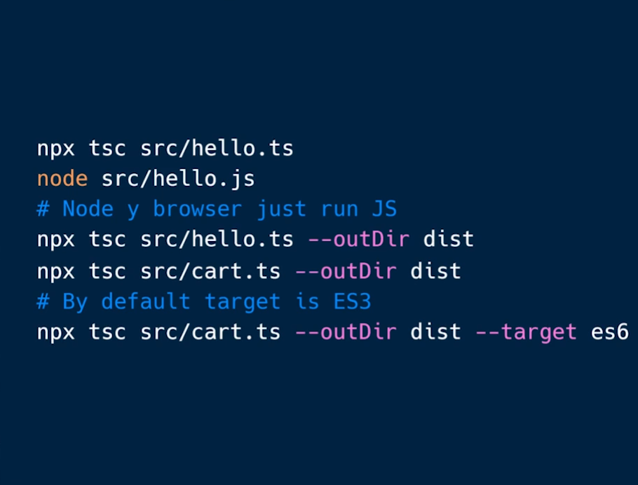

# ts-fundamentals

## Install TypeScript

```bash
npm install typescript --save-dev
```

## Compile TypeScript

Para realizar el proceso de transpilación en Node.js, ejecutemos lo siguiente en la terminal:

```bash
npx tsc <route-file>.ts
```

Tras esto, se creará un archivo JavaScript dentro de la misma carpeta donde este tu archivo TypeScript y con el mismo nombre. Por ejemplo, en nuestro proyecto realizamos esa operación dentro de la carpeta src con el archivo 01-hello.ts.

### Compile a specific JavaScript version

Podemos hacer que nuestro archivo TypesSript sea transpilado a un archivo JavaScript, por ejemplo, con el estándar ECMAScript 6. Para ello ejecutemos:

```bash
npx tsc <route-file>.ts --target es6
```

### Send the output to a specific folder

Si deseas que los archivos transpilados no se generen en la misma carpeta donde están tus archivos TypeScript, puedes indicarle al compilador hacia donde quieres que vayan:

```bash
npx tsc archivo_typescript.ts --target es6 --outDir carpeta_destino
```

Generalmente estos archivos se guardan en la carpeta dist.

También podrías indicar que deseas aplicar la anterior operación a todos los archivos con extensión TypeScript:

```bash
npx tsc *.ts --target es6 --outDir carpeta_destino
```

### Deno: un entorno nativo para ambos lenguajes

Deno, del mismo creador de Node.js, es un nuevo entorno de ejecución para JavaScript que puede correr también nativamente TypeScript. Sin embargo, aún no tiene la madurez en el ecosistema de Node.js

### Resume image


