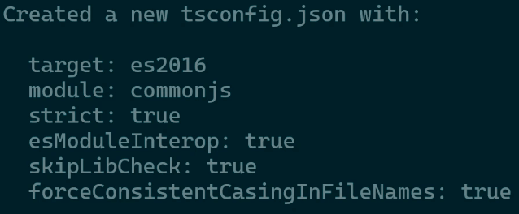

# ts-fundamentals

## Install TypeScript

```bash
npm install typescript --save-dev
```

## Compile TypeScript

Para realizar el proceso de transpilación en Node.js, ejecutemos lo siguiente en la terminal:

```bash
npx tsc <route-file>.ts
```

Tras esto, se creará un archivo JavaScript dentro de la misma carpeta donde este tu archivo TypeScript y con el mismo nombre. Por ejemplo, en nuestro proyecto realizamos esa operación dentro de la carpeta src con el archivo 01-hello.ts.

### Compile a specific JavaScript version

Podemos hacer que nuestro archivo TypesSript sea transpilado a un archivo JavaScript, por ejemplo, con el estándar ECMAScript 6. Para ello ejecutemos:

```bash
npx tsc <route-file>.ts --target es6
```

### Send the output to a specific folder

Si deseas que los archivos transpilados no se generen en la misma carpeta donde están tus archivos TypeScript, puedes indicarle al compilador hacia donde quieres que vayan:

```bash
npx tsc archivo_typescript.ts --target es6 --outDir carpeta_destino
```

Generalmente estos archivos se guardan en la carpeta dist.

También podrías indicar que deseas aplicar la anterior operación a todos los archivos con extensión TypeScript:

```bash
npx tsc *.ts --target es6 --outDir carpeta_destino
```

### Deno: un entorno nativo para ambos lenguajes

Deno, del mismo creador de Node.js, es un nuevo entorno de ejecución para JavaScript que puede correr también nativamente TypeScript. Sin embargo, aún no tiene la madurez en el ecosistema de Node.js

### Resume image


## Creando un archivo TSConfig.json

En la terminal, ubicándonos dentro del directorio en el que queremos que se cree el archivo, ejecutemos:

```bash
npx tsc --init
```

Nos creará automáticamente el archivo con propiedades básicas activadas:


Dentro del archivo `TSConfig.json` podemos ver que tiene muchas propiedades comentadas (desactivadas) y de las cuales solo algunas están activadas.

Luego, se le quita el comentario a la propiedad `outDir` y se le asigna el valor de `./dist` para que los archivos transpilados se guarden en la carpeta dist. Además, nos ahorra tener que enviar `--outDir dist` cada vez que queramos [transpilar](#send-the-output-to-a-specific-folder) un archivo TypeScript.

```json
{
  "outDir": "./dist",
}
```

Otra propiedad que se puede activar es `rootDir`, la cual indica la carpeta donde se encuentran los archivos TypeScript. Si no se especifica, TypeScript asume que los archivos están en la raíz del proyecto.

```json
{
  "outDir": "./dist",
  "rootDir": "./src"
}
```

Y ya se puede transpilar los archivos TypeScript sin necesidad de enviar la ruta del archivo y la carpeta de destino:

```bash
npx tsc
```

## Compilación en tiempo real

Nos puede resultar tedioso estar ejecutando el comando anterior siempre después de escribir nuestro código. Para evitar esto, podemos hacer que el compilador esté detectando cada cambio que realicemos en nuestros archivos TypeScript y haga la transpilación de inmediato:

```bash
npx tsc --watch
```
